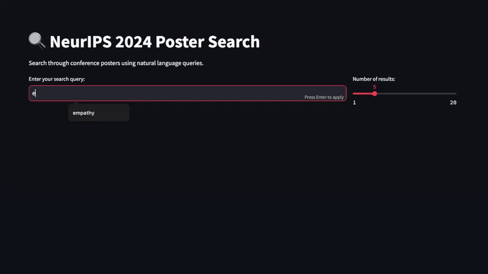

# NeurIPS Paper Search 2024

**NeurIPS Paper Search** help you search through thousands of NeurIPS 2024 posters, in full sentences.

---

## 📹 Demo



---

## 🚀 Features

- **Natural Language Search**: Search papers using full sentences and natural language queries.
- **Poster Details**: Quickly find the exact presentation time and location of posters.


---

## 🛠 Installation

1. Clone this repository:
   ```bash
   git clone https://github.com/your-username/neurips2024.git

2. Navigate to the project directory:
   ```bash
   cd neurips2024

3. Install the dependencies:
   ```bash
   pip install -r requirements.txt

4. Run the app:
   ```bash
   streamlit run app.pyI 